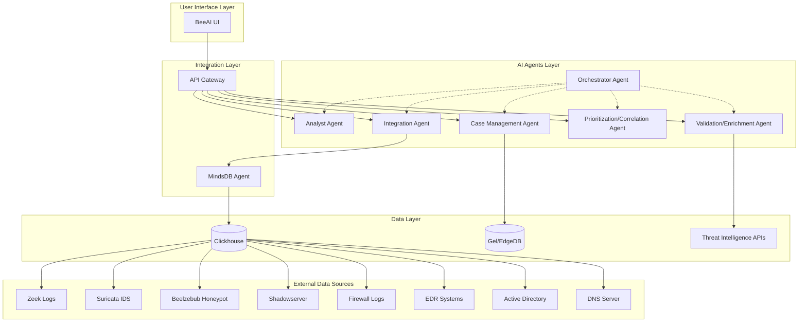
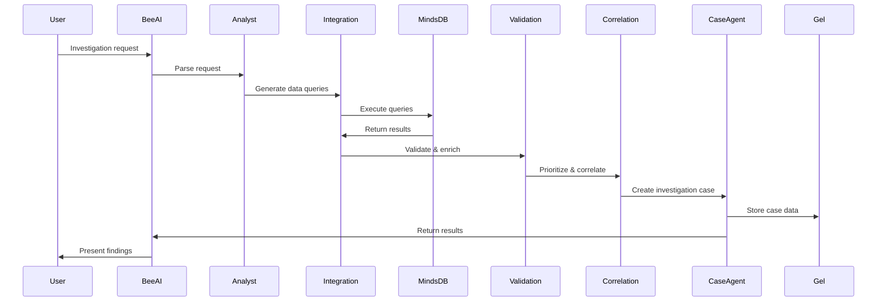
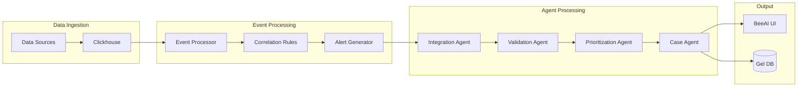

# System Architecture Document

## AI Agents Team for SOC & Threat Hunting

---

## 1. Executive Summary

This document outlines the system architecture for an AI Agents Team designed to support SOC (Security Operations Center) operations and threat hunting activities. The system integrates with existing security infrastructure including Clickhouse data warehouse, MindsDB AI capabilities, and BeeAI platform to provide intelligent threat analysis, event correlation, and investigation case management.

## 2. System Overview

### 2.1 Architecture Principles

- **Microservices Architecture**: Each AI agent operates as an independent service
- **Event-Driven Communication**: Asynchronous messaging between components
- **Data-First Design**: Centralized data access through well-defined APIs
- **Scalability**: Horizontal scaling capability for high-volume environments
- **Extensibility**: Plugin architecture for new data sources and threat intelligence feeds

### 2.2 High-Level Architecture



## 3. Component Architecture

### 3.1 AI Agents Layer

#### 3.1.1 Analyst Agent
**Purpose**: Natural language processing and query translation
**Responsibilities**:
- Parse user requests from BeeAI UI
- Convert natural language queries to structured investigation tasks
- Provide context-aware recommendations
- Generate investigation hypotheses

**Technical Specifications**:
- Language: Python 3.9+
- Framework: LangChain/LlamaIndex
- Memory: Redis for conversation state
- APIs: BeeAI Platform SDK

#### 3.1.2 Integration Agent
**Purpose**: Data source integration and orchestration
**Responsibilities**:
- Interface with MindsDB Agent for data queries
- Manage connections to multiple data sources
- Handle authentication and rate limiting
- Provide unified data access layer

**Technical Specifications**:
- Language: Python 3.9+
- Database Drivers: clickhouse-driver, asyncpg
- Authentication: OAuth 2.0, API Keys
- Connection Pooling: asyncio connection pools

#### 3.1.3 Validation/Enrichment Agent
**Purpose**: Data quality and threat intelligence enrichment
**Responsibilities**:
- Validate query results for accuracy and completeness
- Enrich IOCs with threat intelligence data
- Perform reputation checks and context analysis
- Filter false positives

**Technical Specifications**:
- Language: Python 3.9+
- Threat Intel APIs: MISP, OTX, VirusTotal, etc.
- Caching: Redis for TI lookups
- Data Validation: Pydantic models

#### 3.1.4 Prioritization/Correlation Agent
**Purpose**: Risk assessment and event correlation
**Responsibilities**:
- Calculate threat scores and risk ratings
- Perform temporal and spatial correlation analysis
- Identify attack patterns and campaigns
- Generate priority rankings

**Technical Specifications**:
- Language: Python 3.9+
- ML Libraries: scikit-learn, pandas, numpy
- Graph Analysis: NetworkX for relationship mapping
- Time Series: TimesFM for temporal analysis

#### 3.1.5 Case Management Agent
**Purpose**: Investigation lifecycle management
**Responsibilities**:
- Create and manage investigation cases
- Track evidence and timeline of events
- Maintain case notes and status updates
- Generate investigation reports

**Technical Specifications**:
- Language: Python 3.9+
- Database: Gel (EdgeDB) for case data
- Document Storage: File system with metadata indexing
- Search: Full-text search capabilities

#### 3.1.6 Orchestrator Agent
**Purpose**: Workflow coordination and agent management
**Responsibilities**:
- Coordinate multi-agent workflows
- Manage agent lifecycle and health
- Route requests to appropriate agents
- Aggregate results from multiple agents

**Technical Specifications**:
- Language: Python 3.9+
- Workflow Engine: Temporal.io or Celery
- Service Discovery: Consul or etcd
- Health Monitoring: Prometheus metrics

### 3.2 Integration Layer

#### 3.2.1 API Gateway
**Purpose**: Single entry point for all agent communications
**Responsibilities**:
- Request routing and load balancing
- Authentication and authorization
- Rate limiting and throttling
- Request/response logging and monitoring

**Technical Specifications**:
- Technology: FastAPI or Kong
- Authentication: JWT tokens
- Monitoring: OpenTelemetry tracing
- Rate Limiting: Redis-based token bucket

#### 3.2.2 MindsDB Agent Interface
**Purpose**: Specialized interface for MindsDB interactions
**Responsibilities**:
- Translate agent requests to MindsDB queries
- Handle MindsDB-specific authentication
- Optimize query performance
- Cache frequent queries

**Technical Specifications**:
- Language: Python 3.9+
- MindsDB SDK: Official Python SDK
- Query Optimization: Query plan caching
- Connection Management: Connection pooling

### 3.3 Data Layer

#### 3.3.1 Clickhouse Data Warehouse
**Purpose**: Primary data storage for security events
**Data Sources**:
- Zeek network protocol logs
- Suricata IDS/IPS alerts
- Beelzebub honeypot data
- Shadowserver threat feeds
- Firewall access logs
- EDR telemetry data
- Active Directory events
- DNS query logs

**Schema Design**:
```sql
-- Example table structure for security events
CREATE TABLE security_events (
    timestamp DateTime64(3),
    event_type LowCardinality(String),
    source_ip IPv4,
    dest_ip IPv4,
    source_port UInt16,
    dest_port UInt16,
    protocol LowCardinality(String),
    event_data String,
    threat_score Float32,
    tags Array(String),
    investigation_id Nullable(UUID)
) ENGINE = MergeTree()
PARTITION BY toYYYYMM(timestamp)
ORDER BY (timestamp, event_type, source_ip);
```

#### 3.3.2 Gel (EdgeDB) Case Management
**Purpose**: Investigation case and metadata storage
**Schema Design**:
```edgeql
# Investigation case model
type Investigation {
    required property created: datetime;
    required property updated: datetime;
    required property title: str;
    required property description: str;
    required property status: InvestigationStatus;
    required property priority: Priority;
    property tags: array<str>;
    
    multi link events: SecurityEvent;
    multi link evidence: Evidence;
    multi link notes: InvestigationNote;
    required link assigned_to: User;
}

type SecurityEvent {
    required property timestamp: datetime;
    required property event_type: str;
    required property source_data: json;
    property threat_score: float32;
    property iocs: array<str>;
}

type Evidence {
    required property name: str;
    required property file_path: str;
    required property hash_md5: str;
    required property collected_at: datetime;
}
```

### 3.4 External Integrations

#### 3.4.1 Threat Intelligence Sources
- **MISP**: Malware Information Sharing Platform
- **OTX**: AlienVault Open Threat Exchange
- **VirusTotal**: File and URL reputation
- **Shodan**: Internet-connected device intelligence
- **Custom TI Feeds**: Organization-specific sources

#### 3.4.2 Data Source Connectors
- **Active Directory**: LDAP/LDAPS connections
- **DNS Servers**: DNS query log analysis
- **Cloud Providers**: AWS CloudTrail, Azure Activity Logs
- **SIEM Systems**: Splunk, QRadar integration (future)

## 4. Data Flow Architecture

### 4.1 Investigation Workflow


### 4.2 Real-time Event Processing


## 5. Security Architecture

### 5.1 Authentication & Authorization
- **Multi-factor Authentication**: Required for all users
- **Role-Based Access Control**: SOC Analyst, Threat Hunter, Admin roles
- **API Security**: JWT tokens with short expiration
- **Audit Logging**: Complete audit trail for all actions

### 5.2 Data Protection
- **Encryption at Rest**: AES-256 for sensitive data
- **Encryption in Transit**: TLS 1.3 for all communications
- **Data Classification**: Sensitive IOCs and investigation data marked
- **Data Retention**: Configurable retention policies

### 5.3 Network Security
- **Network Segmentation**: Isolated security zone
- **Firewall Rules**: Restrictive ingress/egress rules
- **VPN Access**: Required for remote administration
- **Intrusion Detection**: Monitor agent communications

## 6. Deployment Architecture

### 6.1 Infrastructure Requirements

#### Production Environment
- **Compute**: 8-16 vCPU, 32-64 GB RAM per agent
- **Storage**: SSD storage with 10K IOPS minimum
- **Network**: 10 Gbps network connectivity
- **High Availability**: Active-passive clustering

#### Development Environment
- **Compute**: 4 vCPU, 16 GB RAM per agent
- **Storage**: Standard SSD storage
- **Network**: 1 Gbps connectivity
- **Single Instance**: Non-clustered deployment

### 6.2 Container Architecture
```yaml
# Docker Compose example
version: '3.8'
services:
  analyst-agent:
    image: beeai-threat-hunter/analyst-agent:latest
    environment:
      - REDIS_URL=redis://redis:6379
      - API_GATEWAY_URL=http://api-gateway:8000
    depends_on:
      - redis
      - api-gateway
      
  integration-agent:
    image: beeai-threat-hunter/integration-agent:latest
    environment:
      - CLICKHOUSE_URL=clickhouse://clickhouse:8123
      - MINDSDB_URL=http://mindsdb:47334
    depends_on:
      - clickhouse
      - mindsdb
      
  api-gateway:
    image: beeai-threat-hunter/api-gateway:latest
    ports:
      - "8000:8000"
    environment:
      - JWT_SECRET=${JWT_SECRET}
```

## 7. Integration Patterns

### 7.1 BeeAI Platform Integration
```python
# BeeAI SDK integration example
from beeai_sdk import BeeAIClient, Agent

class ThreatHuntingAgent(Agent):
    def __init__(self):
        self.client = BeeAIClient()
        self.register_capabilities([
            "threat_analysis",
            "event_correlation", 
            "case_management"
        ])
    
    async def handle_request(self, request):
        investigation = await self.analyze_threat(request)
        return self.format_response(investigation)
```

### 7.2 MindsDB Integration Pattern
```python
# MindsDB query interface
class MindsDBConnector:
    def __init__(self, connection_params):
        self.client = mindsdb_sdk.connect(**connection_params)
    
    async def query_threats(self, query_params):
        sql_query = self.build_threat_query(query_params)
        result = await self.client.query(sql_query)
        return self.parse_threat_results(result)
```

## 8. Monitoring and Observability

### 8.1 Metrics Collection
- **Application Metrics**: Response times, error rates, throughput
- **Infrastructure Metrics**: CPU, memory, disk, network usage
- **Business Metrics**: Cases created, threats detected, false positive rates

### 8.2 Logging Strategy
- **Structured Logging**: JSON format for all log entries
- **Log Levels**: DEBUG, INFO, WARN, ERROR, CRITICAL
- **Log Aggregation**: Centralized logging with ELK/EFK stack
- **Log Retention**: 90 days for operational logs, 1 year for audit logs

### 8.3 Alerting
- **Infrastructure Alerts**: Service downtime, resource exhaustion
- **Application Alerts**: High error rates, processing delays
- **Security Alerts**: Authentication failures, suspicious activities

## 9. Performance Considerations

### 9.1 Scalability Targets
- **Concurrent Users**: 50+ SOC analysts
- **Event Processing**: 10,000+ events per second
- **Query Response**: < 5 seconds for complex queries
- **Case Creation**: < 2 seconds per case

### 9.2 Optimization Strategies
- **Database Optimization**: Proper indexing and partitioning
- **Caching**: Redis for frequent queries and session data
- **Connection Pooling**: Efficient database connection management
- **Async Processing**: Non-blocking I/O for all operations

## 10. Disaster Recovery

### 10.1 Backup Strategy
- **Database Backups**: Daily incremental, weekly full backups
- **Configuration Backups**: Version-controlled configuration files
- **Case Data Backups**: Real-time replication to secondary site

### 10.2 Recovery Procedures
- **RTO Target**: 4 hours maximum downtime
- **RPO Target**: 1 hour maximum data loss
- **Failover Process**: Automated failover to secondary infrastructure
- **Data Recovery**: Point-in-time recovery capabilities

## 11. Future Enhancements

### 11.1 Planned Features
- **SOAR Integration**: Automated response playbooks
- **ML-Based Detection**: Advanced anomaly detection
- **Graph Analytics**: Advanced relationship analysis
- **Mobile Interface**: Mobile app for on-call analysts

### 11.2 Extensibility Points
- **Plugin Architecture**: Custom agent development
- **API Extensions**: Third-party integration capabilities
- **Custom Dashboards**: Configurable visualization
- **Workflow Customization**: Tailored investigation processes

---

## Appendices

### Appendix A: Technology Stack Summary
- **Languages**: Python 3.9+, SQL, EdgeQL
- **Frameworks**: FastAPI, LangChain, Pydantic
- **Databases**: Clickhouse, Gel (EdgeDB), Redis
- **Infrastructure**: Docker, Kubernetes, Prometheus
- **Monitoring**: ELK Stack, Grafana
- **Security**: OAuth 2.0, JWT, TLS 1.3

### Appendix B: API Specifications
[Detailed API documentation would be included here]

### Appendix C: Database Schemas
[Complete database schema definitions would be included here]

---

**Document Version**: 1.0  
**Last Updated**: September 13, 2025  
**Approved By**: System Architect  
**Next Review**: October 13, 2025